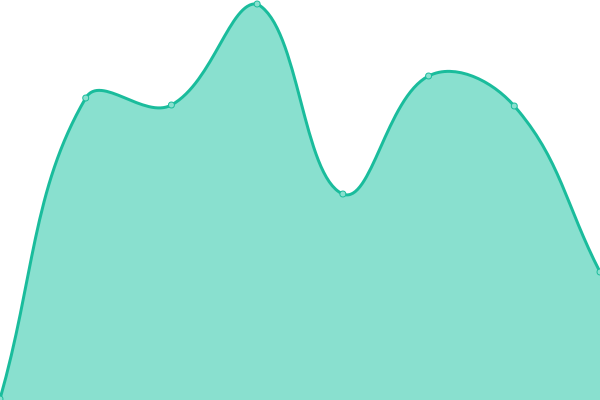
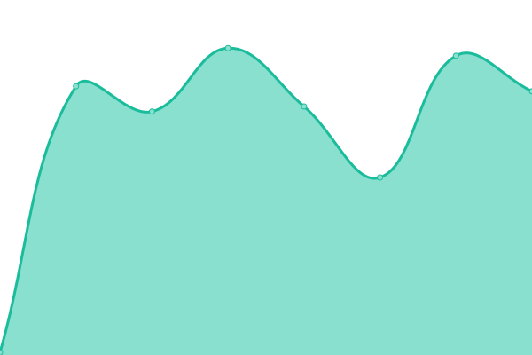
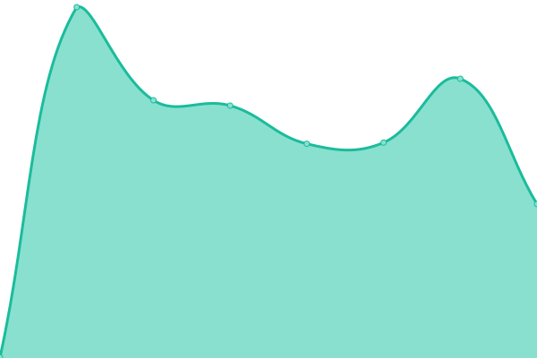
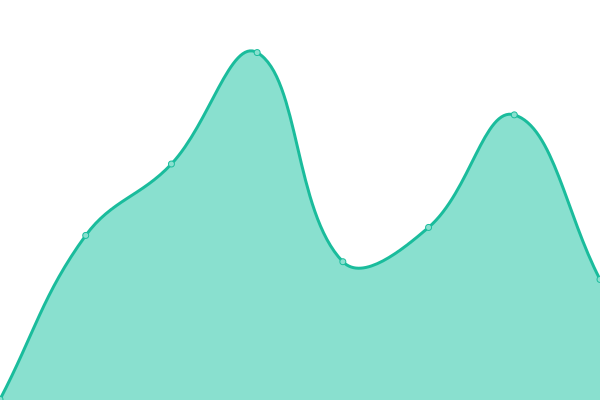
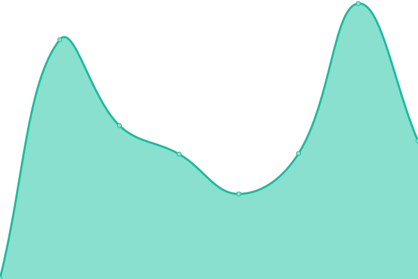
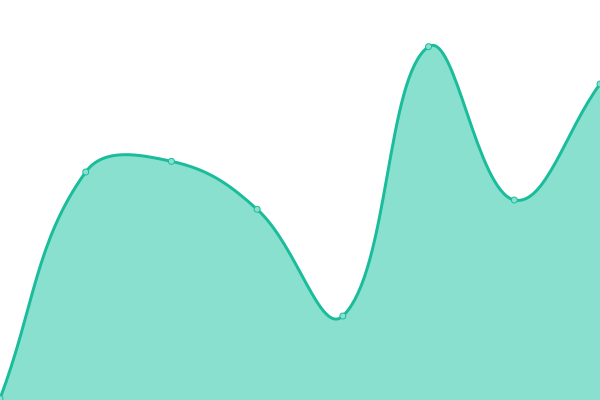
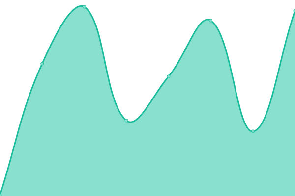
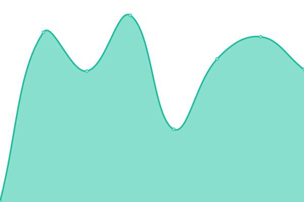

# [📈 Live Status](https://demo.upptime.js.org): <!--live status--> **🟩 All systems operational**

This repository contains the open-source uptime monitor and status page for [eSolia Inc.](https://esolia.com), powered by [Upptime](https://github.com/upptime/upptime).

With [Upptime](https://upptime.js.org), you can get your own unlimited and free uptime monitor and status page, powered entirely by a GitHub repository. We use [Issues](https://github.com/eSolia/uptime/issues) as incident reports, [Actions](https://github.com/eSolia/uptime/actions) as uptime monitors, and [Pages](https://demo.upptime.js.org) for the status page.

<!--start: status pages-->
<!-- This summary is generated by Upptime (https://github.com/upptime/upptime) -->
<!-- Do not edit this manually, your changes will be overwritten -->
<!-- prettier-ignore -->
| URL | Status | History | Response Time | Uptime |
| --- | ------ | ------- | ------------- | ------ |
|  [PROdb Cloud Database PaaS](https://pro.dbflex.net/secure/login.aspx) | 🟩 Up | [pr-odb-cloud-database-paa-s.yml](https://github.com/eSolia/uptime/commits/HEAD/history/pr-odb-cloud-database-paa-s.yml) | 

 252ms
     
 | 

<a href="https://uptime.esolia.pro/history/pr-odb-cloud-database-paa-s">100.00%</a>
    

|  PROdb Cloud Database API | 🟩 Up | [pr-odb-cloud-database-api.yml](https://github.com/eSolia/uptime/commits/HEAD/history/pr-odb-cloud-database-api.yml) | 

 97ms
     
 | 

<a href="https://uptime.esolia.pro/history/pr-odb-cloud-database-api">100.00%</a>
    

|  [M-SODAS Cloud Database](https://db.myriadgenetics-ops.com/secure/login.aspx) | 🟩 Up | [m-sodas-cloud-database.yml](https://github.com/eSolia/uptime/commits/HEAD/history/m-sodas-cloud-database.yml) | 

 357ms
     
 | 

<a href="https://uptime.esolia.pro/history/m-sodas-cloud-database">100.00%</a>
    

|  [eSolia Newsletter System](https://send.esolia.pro) | 🟩 Up | [e-solia-newsletter-system.yml](https://github.com/eSolia/uptime/commits/HEAD/history/e-solia-newsletter-system.yml) | 

 993ms
     
 | 

<a href="https://uptime.esolia.pro/history/e-solia-newsletter-system">100.00%</a>
    

|  [eSolia Secure Text Sharing System](https://salty.esolia.pro) | 🟩 Up | [e-solia-secure-text-sharing-system.yml](https://github.com/eSolia/uptime/commits/HEAD/history/e-solia-secure-text-sharing-system.yml) | 

 303ms
     
 | 

<a href="https://uptime.esolia.pro/history/e-solia-secure-text-sharing-system">100.00%</a>
    

|  [eSolia Screen Connect](https://esolia.screenconnect.com) | 🟩 Up | [e-solia-screen-connect.yml](https://github.com/eSolia/uptime/commits/HEAD/history/e-solia-screen-connect.yml) | 

 2213ms
     
 | 

<a href="https://uptime.esolia.pro/history/e-solia-screen-connect">100.00%</a>
    

|  [eSolia.com English Site](https://esolia.com) | 🟩 Up | [e-solia-com-english-site.yml](https://github.com/eSolia/uptime/commits/HEAD/history/e-solia-com-english-site.yml) | 

 219ms
     
 | 

<a href="https://uptime.esolia.pro/history/e-solia-com-english-site">100.00%</a>
    

|  [eSolia.co.jp Japanese Site](https://esolia.co.jp) | 🟩 Up | [e-solia-co-jp-japanese-site.yml](https://github.com/eSolia/uptime/commits/HEAD/history/e-solia-co-jp-japanese-site.yml) | 

 250ms
     
 | 

<a href="https://uptime.esolia.pro/history/e-solia-co-jp-japanese-site">100.00%</a>
    

|  [J-VAD Site](https://j-vad.jp) | 🟩 Up | [j-vad-site.yml](https://github.com/eSolia/uptime/commits/HEAD/history/j-vad-site.yml) | 

 188ms
     
 | 

<a href="https://uptime.esolia.pro/history/j-vad-site">100.00%</a>
    

|  [J-PVAD Site](https://j-pvad.jp) | 🟩 Up | [j-pvad-site.yml](https://github.com/eSolia/uptime/commits/HEAD/history/j-pvad-site.yml) | 

 207ms
     
 | 

<a href="https://uptime.esolia.pro/history/j-pvad-site">100.00%</a>
    

|  [NSTG Site](https://jp.nanostring.com) | 🟩 Up | [nstg-site.yml](https://github.com/eSolia/uptime/commits/HEAD/history/nstg-site.yml) | 

 337ms
     
 | 

<a href="https://uptime.esolia.pro/history/nstg-site">100.00%</a>
    

<!--end: status pages-->

[**Visit our status website →**](https://demo.upptime.js.org)

## 📄 License

- Powered by: [Upptime](https://github.com/upptime/upptime)
- Code: [MIT](./LICENSE) © [eSolia Inc.](https://esolia.com)
- Data in the `./history` directory: [Open Database License](https://opendatacommons.org/licenses/odbl/1-0/)
